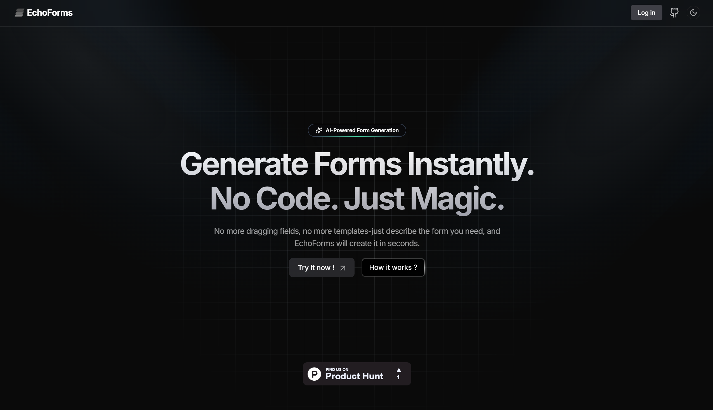

# **EchoForms – AI-Powered Form Builder** 





  

## 🌟 Overview

🚀 **EchoForms** is an AI-powered form generation SaaS that allows users to create and manage forms instantly using simple prompts. With **real-time response tracking, email notifications, and seamless data export**, EchoForms simplifies form creation without any coding.  

---

## **🌟 Features**  

✅ **AI-Powered Form Generation** – Instantly create forms using natural language prompts.  
✅ **Customizable Fields** – Modify fields, add validations, and design forms effortlessly.  
✅ **Instant Sharing & QR Codes** – Get a shareable link and generate a QR code for easy distribution.  
✅ **Real-Time Analytics** – Monitor form responses and gain valuable insights.  
✅ **Email Notifications** – Receive alerts for new form submissions.  
✅ **Seamless Data Export** – Download responses in CSV format for further analysis.  
✅ **User Authentication** – Secure login with **Clerk** authentication.  
✅ **Upgrade Plans with Razorpay** – Upgrade from **Basic to Pro** using secure Razorpay payments.  

--- 

## 💻 Tech Stack

| **Category**   | **Technology**                      |
| -------------- | ----------------------------------- |
| Frontend       | Next.js, TailwindCSS                |
| Backend        | Next.js API Routes, Drizzle ORM, PostgreSQL                                             |     
| AI Integration | Gemini API                          |
| Tools          | Zod, Docker                         |
| Authentication | Clerk                               |
| Deployment     | Vercel                              |

---

## 📥 Installation

1. Clone the repository:
   ```bash
   git clone https://github.com/10xshivam/EchoForms.git
   cd echoforms
   ```
2. Install dependencies:
   ```bash
   npm install
   ```
3. Set up environment variables:
   - Copy `.env.example` to `.env`.
   - Add required keys.
4. **Initialize the database:**
   ```bash
   npx drizzle-kit generate
   npx drizzle-kit migrate
   ```
5. Start the development server:
   ```bash
   npm run dev
   ```

---

## 🤝 Contribution Guidelines

### 🌱 How to Get Involved

1. **Fork the repository** by clicking the "Fork" button.
2. **Clone your fork:**
   ```bash
   git clone https://github.com/10xshivam/EchoForms.git
   ```
3. **Create a new branch:**
   ```bash
   git checkout -b feature/<feature-name>
   ```
4. **Make changes** and commit:
   ```bash
   git add .
   git commit -m "Your descriptive commit message"
   ```
5. **Push changes:**
   ```bash
   git push origin <your-branch-name>
   ```
6. Open a pull request.

### 📌 Suggested Contributions

- **Enhance Response Analytics** – Introduce better visualization charts and trends.  
- **Improve Email Notifications** – Allow more customization for email alerts and templates.  
- **Add Form Templates** – Provide pre-built templates for surveys, registrations, and feedback forms.  
- **Optimize Performance** – Improve loading times and database efficiency. 

---

## 🌟 Stargazers & Forkers

We appreciate your support! 🌟🍴

[](https://github.com/10xshivam/EchoForms/stargazers) [](https://github.com/10xshivam/EchoForms/network/members)

---

## 🛡 License

EchoForms is licensed under the MIT License.

---


## 📬 Contact

For queries or collaborations:

- Email: [kumarshivam3788@gmail.com](mailto:kumarshivam3788@gmail.com)
- LinkedIn: [codrshivam](https://www.linkedin.com/in/codrshivam/)
- Twitter: [@shivamcodes_](https://x.com/shivamcodes_)